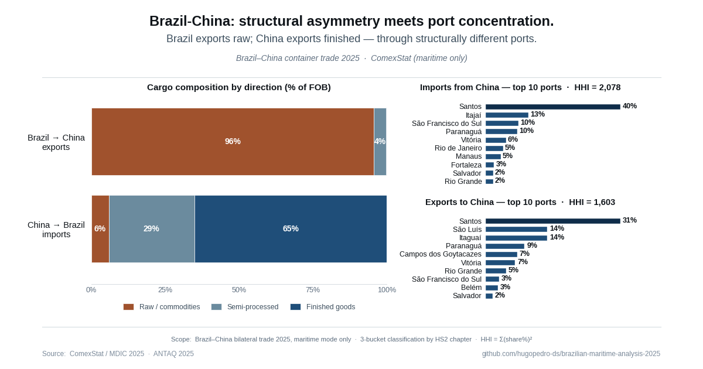

# Post 8 — Brazil-China trade asymmetry (2025)

**Published on LinkedIn:** 22 June 2026
**Author:** Hugo Pedro — [linkedin.com/in/hugopedro](https://www.linkedin.com/in/hugopedro/)

## The thesis

Brazil-China is Brazil's largest bilateral trade lane. But the structure of that lane is much more asymmetric than the headline number suggests — across three dimensions: cargo composition, port concentration, and infrastructure.

## Key findings

### 1 — Cargo composition is extreme by direction

- **96% of Brazil → China exports** are raw commodities (soybeans, iron ore, oil, sugar). Finished goods represent only **0.3%**.
- **65% of China → Brazil imports** are finished goods (machinery, electronics, vehicles, industrial products). Raw goods represent only **6%**.
- **Average value per tonne:** USD 645 leaving Brazil, USD 1,953 entering — a 3x value gradient.

### 2 — Import ports concentrate in container hubs

- **Santos handles 40%** of all Chinese imports into Brazil.
- Top 5 ports (Santos, Itajaí, São Francisco do Sul, Paranaguá, Vitória) account for **79%**.
- **HHI = 2,078** (DOJ/FTC 2010 — moderately concentrated, near upper threshold).
- All top-10 import ports are container-handling multi-purpose facilities.

### 3 — Export ports follow a completely different logic

- Brazilian exports to China move through **specialised bulk and commodity terminals**, not container hubs.
- **Itaguaí + São Luís** combined handle **28%** — both Vale's iron-ore terminals (Sudeste and Ponta da Madeira).
- **Campos dos Goytacazes** processes **7%** in offshore oil from the Bacia de Campos basin.
- **HHI = 1,603** (moderately concentrated, just above lower threshold) — more fragmented than imports because of commodity specialisation across multiple terminals.

### 4 — The lane is structurally two markets, not one

The front-haul (China → Brazil) behaves like a container market with port concentration and pricing power dynamics. The back-haul (Brazil → China) behaves like a commodity market routed through specialised terminals owned mostly by single operators. For procurement and freight forwarders modelling this corridor, the implication is that rates, lead times, and operational characteristics do not transfer cleanly from one direction to the other.

## The chart



## Data sources

- **ComexStat / MDIC 2025** — Brazilian government open data on bilateral trade flows
  - Exports BR → China by HS2 chapter and by URF
  - Imports China → BR by HS2 chapter and by URF
- **ANTAQ 2025 (Atracação)** — Brazilian maritime regulator open data (referenced for future Post 9 carrier analysis)

All data restricted to **maritime mode only** (Via = MARÍTIMA in ComexStat).

## Repository structure (this post)

```
posts/post08-china-brazil/
├── README.md                          ← you are here
├── methodology.md                     ← methodology, decisions, limitations
├── docs/
│   └── post_draft.md                  ← LinkedIn post text (English)
├── data/                              ← raw CSV exports from ComexStat
│   ├── br_to_china_2025_chapters.csv
│   ├── br_to_china_2025_ports.csv
│   ├── china_to_br_2025_chapters.csv
│   └── china_to_br_2025_ports.csv
├── scripts/
│   ├── post8_china_brazil_analysis.py ← Blocks 1-4B: load, clean, classify, aggregate
│   └── build_post8_chart.py           ← composite chart (3 panels)
└── outputs/
    ├── post8_china_brazil_chart.png   ← final chart
    ├── summary_metrics.csv            ← HHI + concentration shares
    ├── br_to_cn_by_category.csv       ← exports by raw/semi/finished
    ├── cn_to_br_by_category.csv       ← imports by raw/semi/finished
    ├── br_to_cn_ports_top10.csv       ← top 10 export ports (chart data)
    ├── cn_to_br_ports_top10.csv       ← top 10 import ports (chart data)
    ├── cn_to_br_ports_clean.csv       ← all import ports after URF cleanup
    ├── port_concentration_full.csv    ← all ports with HHI contributions
    └── port_concentration_chart_data.csv
```

## Reproducibility

From the repo root:

```bash
cd posts/post08-china-brazil
python scripts/post8_china_brazil_analysis.py
python scripts/build_post8_chart.py
```

Requires Python 3.10+ with pandas, matplotlib, numpy (see `requirements.txt` at repo root).

## Limitations declared

See [`methodology.md`](methodology.md) for full methodology, classification decisions, and limitations. Key points:

- HS2 classification is a simplification; ~10-15% of trade could be classified differently without changing the directional asymmetry conclusion.
- Single-year scope (2025); no longitudinal trend tested.
- No carrier-level analysis (reserved for Post 9).
- No transit-time, schedule reliability, or AIS data.
- No tariff or commercial-terms data.
- Two export URFs (São Luís, Itaguaí) report kg = 0 for FOB-valid records — known ComexStat limitation for heavy bulk; their FOB values are kept and analyzed, kg-based metrics excluded.

## What this post does NOT claim

- That HHI = 2,078 (imports) means the market is broken. Concentration may reflect rational economic scale.
- That specialised export terminals are inefficient. They are specialised for legitimate operational reasons.
- Anything about carriers, services, transit times, or freight rates — out of scope.

## Citation

> Pedro, H. (2026). Post 8 — Brazil-China trade asymmetry 2025. GitHub case study, hugopedro-ds/brazilian-maritime-analysis-2025.

## Feedback

Methodology challenges, classification disputes, and corrections are welcome via GitHub issues or pull requests.
