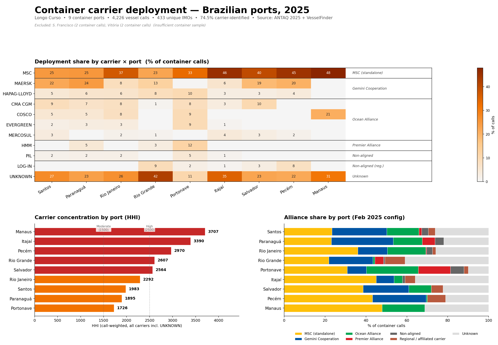

# Post 9 — Container carrier deployment, Brazilian ports 2025

**Who actually serves the Brazil container corridor, where is the real optionality at port level, and where does carrier concentration bite procurement?**



---

## Headline findings

Nine Brazilian container ports split into two very different procurement markets.

**Highly concentrated — HHI ≥ 2,500**
Manaus 3,707 | Itajaí 3,390 | Pecém 2,970 | Rio Grande 2,607 | Salvador 2,564
Only 2 to 4 carriers above 5% share dominate the market.

**Moderately concentrated — HHI < 2,300**
Rio de Janeiro 2,292 | Santos 1,983 | Paranaguá 1,895 | Portonave 1,726
Real optionality. Santos has 4 carriers above 5% share; Portonave has 6.

Three findings a spreadsheet-based procurement model tends to miss:

- **MSC is #1 in 9 of 9 ports**, 23–48% share depending on the port. Not competition — structural dominance.
- **Gemini Cooperation captured 21.9%** of alliance-level calls in the first 10 months post-launch (Feb–Nov 2025). Rapid materialisation of the 2025 alliance realignment.
- **Portonave is the only port where the Premier Alliance is materially present.** Everywhere else, ONE/HMM/YM is residual.

The alliance-level HHI on identified carriers is **2,791 — "highly concentrated"** by the DOJ/FTC rule. The negotiation surface for a China–Brazil Trade Lane Manager is not 12 carriers. It is 3 alliance blocks plus MSC standalone (MSC 28.9% • Gemini Cooperation 21.9% • Ocean Alliance 13.8%).

---

## Scope and numbers at a glance

| Metric | Value |
|---|---|
| Dataset | ANTAQ 2025 (Jan–Nov), Longo Curso only |
| Container terminals | 15 (whitelisted from operational knowledge) |
| Ports in the analysis | 9 (São Francisco do Sul and Vitória excluded — insufficient container sample) |
| Vessel calls analysed | 4,226 |
| Unique IMOs | 433 |
| Vessel names sourced | VesselFinder public page (975 IMOs, 100% scraped OK) |
| Carrier-identified rate | 74.5% |
| Unknown (charter/tramp without carrier brand) | 25.5% |
| Alliance-level HHI (identified) | 2,791 (highly concentrated) |

---

## Alliance breakdown (Feb 2025 configuration)

| Alliance | Members represented in dataset | Share of calls |
|---|---|---|
| MSC (standalone) | MSC | 28.9% |
| Gemini Cooperation | Maersk + Hapag-Lloyd | 21.9% |
| Ocean Alliance | CMA CGM + Cosco + Evergreen + OOCL | 13.8% |
| Premier Alliance | ONE + HMM + Yang Ming | 3.2% |
| Non-aligned (global) | ZIM + PIL + Wan Hai | 3.0% |
| Regional / affiliated carrier | Mercosul (CMA CGM group) + Log-In | 3.5% |
| Unknown (unclassified) | Charter/tramp with no carrier brand in the name | 25.7% |

Mercosul Line and Log-In are treated as **regional / affiliated carriers** rather than Ocean Alliance members, because their commercial deployment is intra-Brazil / intra-LatAm, not long-haul alliance service.

---

## What is in this folder

| File | What it is |
|---|---|
| `outputs/post9_slide1_deployment.png` | LinkedIn carousel slide 1 — deployment heatmap |
| `outputs/post9_slide2_concentration.png` | LinkedIn carousel slide 2 — HHI + alliance share |
| `outputs/post9_chart_final.png` | 3-panel composite chart (for this README) |
| `outputs/post9_linkedin_texts.docx` | LinkedIn post text — EN, PT, hybrid |
| `outputs/methodology.md` | Full methodology, filters, regex logic, limitations |
| `scripts/extract_imos_v2.py` | ANTAQ 2025 → container-terminal IMO list |
| `scripts/scrape_vessel_names.py` | VesselFinder public page scraper |
| `scripts/carrier_from_vessel_name_v2.py` | Regex classification + HHI + outputs |
| `scripts/chart_carousel_v3.py` | LinkedIn carousel slide generator |
| `scripts/chart_final.py` | 3-panel composite chart generator |
| `data/vessel_names.csv` | 975 IMOs, VesselFinder scrape |
| `data/carrier_by_call.csv` | Every classified vessel call |
| `data/carrier_summary.csv` | Carrier-level aggregates |
| `data/group_summary.csv` | Parent-group aggregates |
| `data/alliance_summary.csv` | Alliance-level aggregates (Feb 2025 config) |
| `data/carrier_port_matrix.csv` | Carrier × port pivot (deployment share) |
| `data/hhi_summary.csv` | All HHI variants (carrier / group / alliance, raw and identified-only) |
| `data/unknown_vessels_audit.csv` | Top-100 UNKNOWN vessels for review |
| `data/container_terminals_breakdown.csv` | Whitelisted terminals with call and IMO counts |

---

## Reproducibility

```bash
python scripts/extract_imos_v2.py
python scripts/scrape_vessel_names.py       # ~7-8 hours, respectful rate limit
python scripts/carrier_from_vessel_name_v2.py
python scripts/chart_carousel_v3.py         # LinkedIn slides
python scripts/chart_final.py               # composite chart for README
```

---

## Limitations (declared upfront)

- Vessel-name matching is a proxy for carrier deployment. It captures branded fleets well and charter fleets poorly.
- Call counts do not equal TEU-weighted capacity. MSC's 28.9% call share ≠ 28.9% of moved boxes.
- Full-year 2025 dataset used because ANTAQ 2026 is not yet consolidated. A 2026 refresh is planned once the data lands.
- Alliance shares reflect the February 2025 configuration and capture the first 10 months post-Gemini launch (Feb–Nov 2025).
- UNKNOWN 25.5% is a data limitation, not a modelling flaw. Charter tonnage in Brazil is opaque by design; without proprietary carrier schedule data (Alphaliner, Sea-Intelligence), attribution is not possible.
- São Francisco do Sul and Vitória were excluded because they moved fewer than 20 container vessel calls in the period; the terminals do exist but are primarily used for general cargo and Ro-Ro traffic, not container long-haul.

Full methodology and decisions in [`outputs/methodology.md`](outputs/methodology.md).

---

## Related work

- **Post 8** — Brazilian ports, China trade flows, category concentration ([link](../post08-china-brazil-flows/))
- **Post 4** — West & Central Atlantic Africa container corridor ([link](https://github.com/hugopedreira/west-africa-container-corridor))

---

*Case study — feedback welcome. Open an issue if you spot something.*
